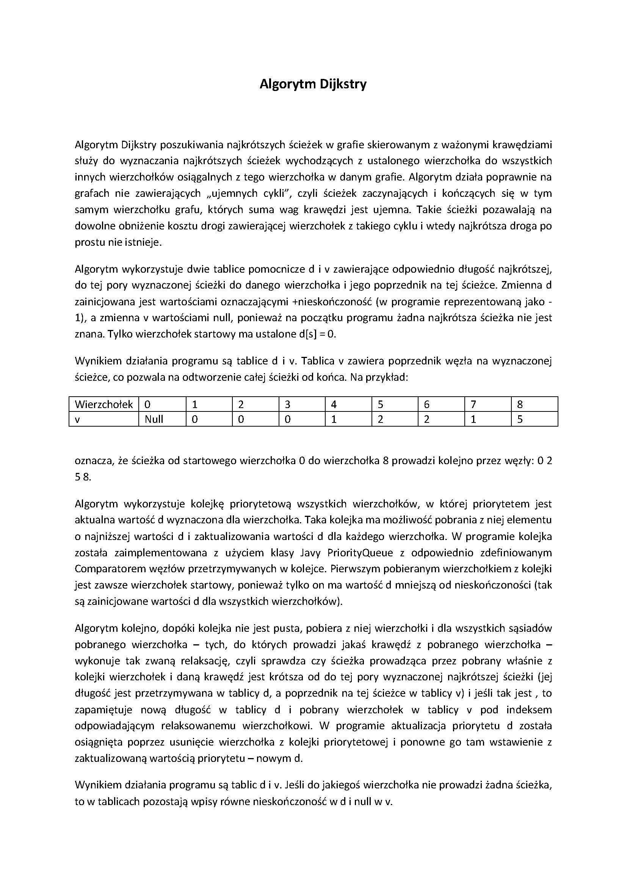
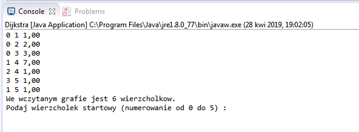

# Dijkstra's Algorithm
> Own Java Dijkstra's Algorithm project implementation for Shortest Path Directed

## Table of contents
* [General info](#general-info)
* [Technologies](#technologies)
* [Setup](#setup)
* [Status](#status)
* [Contact](#contact)

## General info

## Technologies
* Java

## Setup
Simply in Command line (for Windows type: Win + R -> cmd -> (%PATH% to proper Java program directory -> javac Dijkstra.java -> java Dijkstra)

## Code Examples
`public static void main(String args[]) throws FileNotFoundException {		
		Scanner scr = new Scanner(new File("graf.txt"));
		scr.useLocale(Locale.US);		
		int n = scr.nextInt();
		for(int i = 0; i < n; ++i) {
			nodes.put(i, new Node(i));
		}
		while(scr.hasNext()) {
			int from = scr.nextInt();
			int to = scr.nextInt();
			double weigth = scr.nextDouble();
			nodes.get(from).edgesOut.put(to, new Edge(to, weigth));
			System.out.format("%d %d %.2f\n", from, to, weigth);
		}
		scr.close();`

## Status
Project is: _finished_

## Contact
Powered by [@techalive] - feel free to contact me!